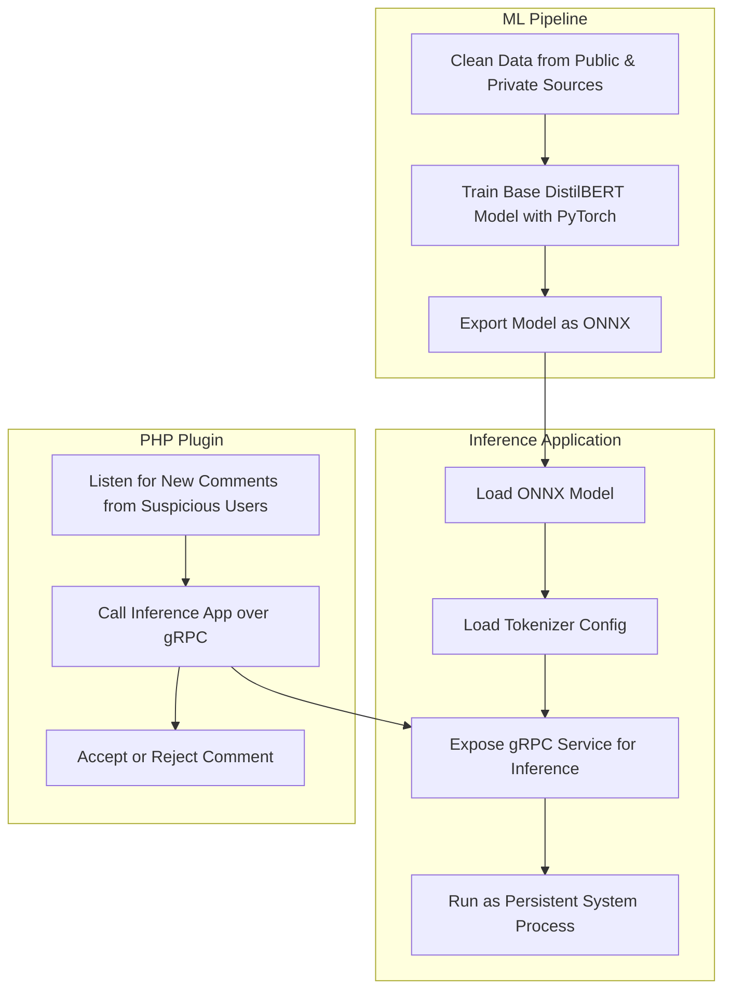

# DistilBERT model for detecting spam messages

This trains and runs a DistilBERT model to classify text as spam. The
use case is to develop a plugin to stop spam in forums or blog
comments.

This model is very compact—for a transformer model—and can run
inference tasks on a low-powered ARM64 CPU with as little as 1-2GB of
memory.

## Architecture



## ML

### Training

This model was trained on both public and private datasets. The code to reproduce the training step is included in this repository.

It is a DistilBERT model fine-tuned from the original `distilbert-base-uncased`.

### Pretrained model

A pretrained model is available [in this repository](./results/onnx_quantized/model_quantized.onnx)

Note: This model is quantized for the ARM64 instruction set.

## Setup and usage

### gRPC server

The easiest way to get started is with Docker.

```bash
docker build -t forum-spam-filter .
docker run --rm -p 60066:60066 forum-spam-filter
```

Then in a separate shell, test out the server with a tool like [grpcurl](https://github.com/fullstorydev/grpcurl):

```bash
grpcurl -plaintext -import-path ./proto -proto spam_classifier.proto \
  -d '{"text": "As a valued part of our community, you are eligible for an exclusive airdrop of 10.3 million OP tokens reserved just for engaged members like you."}' \
  '[::]:60066' \
  forum_spam_filter.SpamClassification/Classify
```

which returns the output:

```json
{
  "probability": 0.99896145
}
```

You can integrate this into your system however you like. The
[proto/](proto/) directory contains the protobuf definitions necessary
to generate client code.

An Ansible role is included in [tools/ansible/](./tools/ansible) which
you may find helpful to set up and install the gRPC server without
using Docker.

### phpBB3 forum extension

This also includes [an extension for the phpBB3 forum
software](./phpbb3_extension) which automatically disapproves posts
which are classified as spam.

### CLI (advanced)

```bash
# Install shared libraries for the ONNX Runtime

mkdir ./onnxruntime

# Choose a release for your platform from https://github.com/microsoft/onnxruntime/releases

# Linux x86_64
curl -L https://github.com/microsoft/onnxruntime/releases/download/v1.20.1/onnxruntime-osx-arm64-1.20.1.tgz \
  | tar -xz --strip-components=1 -C ./onnxruntime
export ORT_DYLIB_PATH=$PWD/onnxruntime/lib/onnxruntime.so

# macOS aarch64
curl -L https://github.com/microsoft/onnxruntime/releases/download/v1.20.1/onnxruntime-osx-arm64-1.20.1.tgz \
  | tar -xz --strip-components=1 -C ./onnxruntime
export ORT_DYLIB_PATH=$PWD/onnxruntime/lib/onnxruntime.dylib

# Build Rust binary
cargo build --release --bin cli
```

Then you can run it like this:

```bash
$ export MODEL_PATH=$PWD/results/onnx_quantized/model_quantized.onnx
$ cat <<EOF | ./target/release/cli
As a valued part of our community, you are eligible for an exclusive airdrop of 10.3 million OP tokens reserved just for engaged members like you.
EOF

Spam: 99.90%
Predicted Class: "Spam"
```

## License

Apache-2.0
