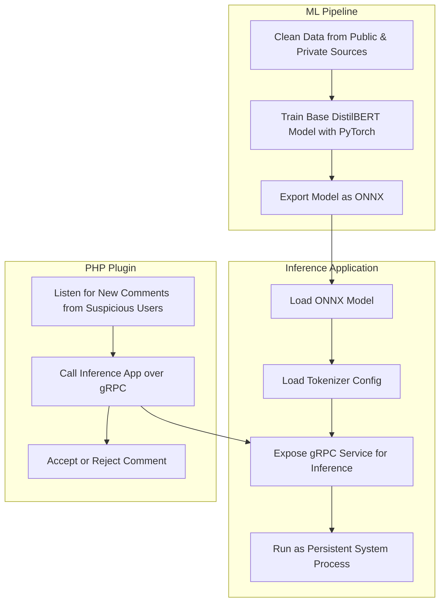

# DistilBERT model for detecting spam messages

This trains and runs a DistilBERT model to classify text as spam. The
use case is to develop a plugin to stop spam in forums or blog
comments.

Work in Progress

## Architecture

